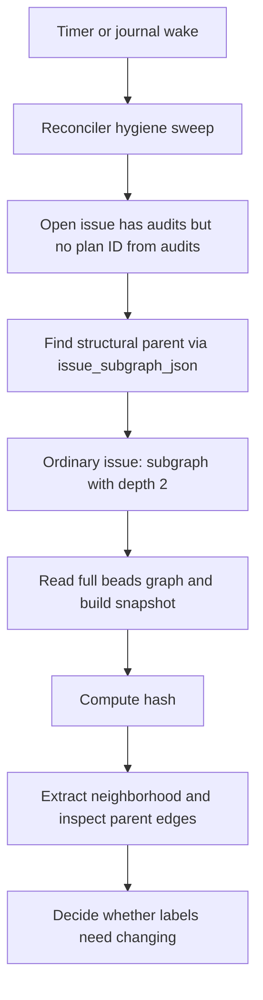
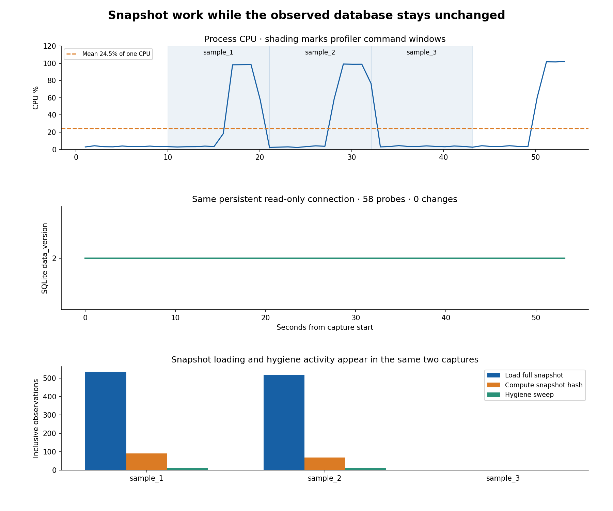

# Why beads graph snapshots repeat

Investigation: **bd-94thj**, 2026-10-09. Observed process: `spur` PID **71291**.

The beads issue/dependency graph is materialized on demand **on every GraphEngine request**. It is not retained until the database changes. Background plan reconciliation is one source of those requests, so materialization can recur without a user asking for graph retrieval. This finding concerns `spur-pm::graph_engine`; it does not establish that source-code retrieval rebuilds the separate `spur-graph` index.

## Source evidence

Source inspected at `3315391e245e4be98b08b31dba0ec7d91dbb5bab`; exact file hashes are in [source-provenance.json](source-provenance.json). The running binary's exact build SHA is not exposed, so the source analysis and runtime observations are related evidence, not a proven binary/source identity.

1. [GraphEngine::snapshot](../../../crates/spur-pm/src/graph_engine/mod.rs#L538) unconditionally calls `load_graph_snapshot`, then `compute_data_hash`. The engine stores only its beads adapter and configuration. There is no cached snapshot or pre-load revision check; computing a hash after loading cannot avoid that load.
2. [load_graph_snapshot](../../../crates/spur-pm/src/graph_engine/snapshot.rs#L223) reads issues, labels and dependencies, and constructs new nodes and edges. The unfiltered path includes closed and deferred issues, excluding tombstones. It uses the recently added dependency batch read.
3. [GraphEngine::subgraph](../../../crates/spur-pm/src/graph_engine/mod.rs#L576) first loads and hashes the **full** snapshot, then extracts the requested neighborhood. A depth-two request does not bound database loading to two hops. [PmService::issue_subgraph_json](../../../crates/spur-pm/src/service.rs#L346) takes this path unless an epic's plan label selects the filtered path. The filtered path also creates a fresh snapshot.
4. [run_index_hygiene_sweep](../../../crates/spur-core/src/plan/reconciler/mod.rs#L1838) examines open issues and their audit comments. When an issue has audits but `expected_plan_id_from_audits` cannot determine ownership, [index_hygiene_sweep](../../../crates/spur-core/src/plan/reconciler/mod.rs#L1888) invokes [expected_plan_id_from_parent_epic](../../../crates/spur-core/src/plan/reconciler/mod.rs#L2095). That function calls `issue_subgraph_json` and filters structural `parent-child` edges. The lookup precedes deciding whether any labels need changing.
5. The [reconciler loop](../../../crates/spur-core/src/plan/reconciler/mod.rs#L1197) waits for its timer or a journal/fast-forward notification, then runs a tick. Defaults are a 3-second base delay, doubling while idle to 30 seconds; the [server configuration](../../../crates/spur-core/src/server/mod.rs#L1200) retains these defaults. These are waits **plus sweep duration**, with notifications able to wake earlier, not a measured rebuild rate.

Thus K eligible non-epic parent lookups can cause K full materializations in a sweep, even if the sweep changes nothing. Issues without audits take another path; an audit containing the needed plan ID avoids this fallback. We have not measured K or exact invocation counts.

Other callers include explicit MCP graph requests and triage refreshes. The database reader actor runs submitted closures; neither it nor BvAdapter supplies snapshot memoization. The async handoff also prevents a profiler stack from connecting every loader invocation to its requester.

## Fresh observation

Captured **10:39:05–10:39:59 +07:00**, for **53.168 seconds**, with ten seconds before profiling, three requested 10-second macOS samples at 5 ms, and ten seconds afterward. A persistent read-only SQLite connection probed `PRAGMA data_version` alongside process telemetry. No graph requests, issue writes, or notebook execution were initiated by the investigator during this capture; normal background work continued.

| Sample | Thread observations | Snapshot-load observations | Hash observations | Hygiene-sweep observations |
|---|---:|---:|---:|---:|
| 1 | 86,000 | 535 | 91 | 11 |
| 2 | 86,500 | 516 | 69 | 11 |
| 3 | 86,400 | 0 | 0 | 0 |

These are **inclusive stack observations, not rebuild counts or CPU-time percentages**. Counts across frames may overlap. Snapshot frames appeared on four beads database reader threads in each of the first two samples. The third sample saw no such frames: activity was intermittent, not continuous in all windows.

All **58 database probes returned data_version 2**, with zero probe errors and zero detected transitions. SQLite documents comparisons on the same connection as an indicator of commits from other connections; values across separate connections are not comparable. This supports no detected database commits during the measured window, not a per-row content proof. [SQLite documentation](https://www.sqlite.org/pragma.html#pragma_data_version)

Process CPU averaged **24.50% of one CPU** and peaked at **101.87%** over the retained telemetry intervals. The sample corroborates loading and hashing during an unchanged database window, with hygiene activity in the same two captures. The source explains a reachable causal path, but sampling does not exclusively attribute all builds to hygiene or determine their count. Prior in-flight work and profiler overhead remain possible contributors to total CPU. RSS changes are not evidence of a snapshot memory leak.

CPU counters use this host's Mach timebase, `125 / 3` nanoseconds per tick, rather than assuming nanoseconds. The earlier notebook section independently checked this conversion against `ps`. Raw telemetry, sampler output and metadata accompany this report.

Database counts read after capture: 2,327 issues (397 open), 3,092 dependency records. The 235 open issues with an audit marker are **not** an eligible-fallback count: marker presence alone does not establish valid audits or missing plan ownership.

## Solver result and scope

Used the `workflow` rule catalog: `initial_state_allowed`, `transition_allowed`, `bounded_reachability`, and `safety_invariant`. No generic encoding was necessary. Exact requests, assumptions and raw results are saved in the three `.solve.json` files.

| Query | Result | Solve ID |
|---|---|---|
| Current source-derived policy; find duplicate materialization in two unchanged-revision requests | SAT / solution: `Cold → Materialized → RedundantBuild` | `sol_41e3b2a8b3f249e4` |
| Proposed reuse policy; verify read/read trace | SAT / pass: `Cold → Materialized → Materialized` | `sol_516232252ccf410e` |
| Proposed reuse policy; search for duplicate materialization within two requests | UNSAT / infeasible | `sol_c1919defaffa4a68` |

This is a bounded consistency check of a **source-derived abstraction**, not automatic verification of Rust or an independent runtime measurement. It assumes two sequential successful requests, one unchanged database revision and the same full-snapshot scope. `Cold` means no materialization counted in the trace. Concurrency, mutation during construction, invalidation, eviction, failures and time-dependent report freshness are outside the model. The proposed cache is **not implemented**.

## Implication for a change

The recent fixes (`558049525`, `52a9d71e0`, `d58083d44`) improve index setup and dependency-read batching. They reduce individual materialization costs; they do not add snapshot reuse. The earlier [fix report](../2026-10-09-spur-fixes/REPORT.md) measured 21.068 → 9.294 ms on a 5,000-ID fixture, not an end-to-end or before/after measurement of this running process.

Two concrete options follow from this investigation:

- Replace structural-parent lookup through a full subgraph with a targeted typed dependency query, preserving the current checks for multiple parents. This removes unnecessary whole-graph work from the hygiene path.
- Share an immutable snapshot for a database revision and query scope. Build once, reuse while unchanged, and invalidate for both in-process and external writes. Coordinate concurrent misses and construct from a consistent database view. Report freshness can depend on time even if graph data is unchanged, so report caching needs separate rules.

Before implementation, add observability for snapshot invocation count, caller, scope, revision, duration and cache hits. Then replay two same-revision requests and a real mutation to establish reuse and invalidation. This investigation makes no production code changes.

## Reproduction and verification

Open [the executed notebook](../../../spur-71291-live-performance-20261009.ipynb), then run the appended snapshot follow-up section's four Python cells in order. This section imports its own helpers and uses the committed artifacts here; it does not require the earlier section's local `deliveries/` capture. Run from the repository root, or adjust `SNAP_ROOT`. Plotting requires matplotlib and the notebook's IPython environment. Solver cells inspect saved solver responses rather than silently rerunning requests.

For a new live capture on macOS, copy `capture.py` to a fresh directory and update its PID and database path before running it. It refuses to overwrite existing telemetry. A repeat is a new observation, not expected to reproduce exact sampled counts.

The final notebook cell validates process identity, monotonic counters, sampler exits, stack-count conservation, known-wait totals against macOS sample's independent collapsed summary, database probes, all solver cases and plot existence. [verification.json](verification.json) records the result; [sha256.json](sha256.json) anchors companion files. Notebook cells were executed successfully and the rendered chart was visually inspected. No Rust behavior was changed, so no Rust build or test suite was run for this documentation investigation.
