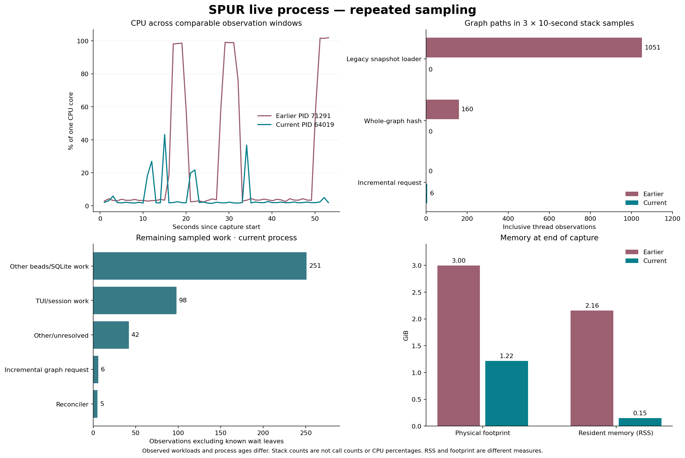
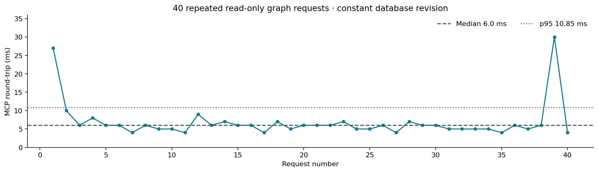

# Current SPUR process evaluation — bd-bnfro

Notebook: [spur-64019-performance-20261009.ipynb](../../../spur-64019-performance-20261009.ipynb)

## Evaluation

The running process is using the incremental graph path. During the new ambient capture, mean CPU was **5.04% of one core**, compared with **24.50%** in the earlier capture: **79.4% lower observed CPU**. This is an observational comparison, not a matched-workload speedup benchmark.

### Snapshot behavior

Across three native samples, the old capture contained **1051** inclusive observations under the snapshot loader and **160** under whole-graph hashing. The current capture contained **0** and **0**, respectively, and **6** observations of the incremental graph request path.

The ambient database did change: its graph revision moved from **9 to 15**. During the separately recorded 40-request test, revision **15** and the SQLite commit token stayed constant. All responses were identical and carried one `g2:` fingerprint. Median MCP round-trip was **6.0 ms**, p95 **10.85 ms**, maximum **30 ms**.

These results support graph reuse in the running build. Equal fingerprints alone do not prove cache hits, and sampled frame absence does not prove an exact rebuild count. No live cache-hit/full-build counter was exposed during this test; the earlier isolated work-counter tests provide that separate implementation evidence.

### Remaining work visible in the profile

Other beads/SQLite work accounts for **251** observations, and TUI/session work for **98**, among **402** observations excluding known wait leaves. `SqliteStorage::list_issues` remains the main identifiable database path. Its reader-thread stacks do not identify the original asynchronous requester, so a next investigation should correlate recurring issue-list requests with their callers before choosing another optimization.

### Memory

Physical footprint ended at **1.22 GiB**, versus **3.00 GiB** earlier. Current RSS was **151.6 MiB**. The gap between RSS and footprint matters: it is not evidence that total memory demand is only the RSS value. Process age, compression, and cache contents differ; this short observation does not establish a memory leak or its resolution.

### Method and limits

- Ambient capture: **53.14 s**, beginning **2026-10-09T06:23:30.788634+00:00**; 10 s baseline, three 10 s native samples requested at 5 ms, then 10 s recovery. Sampler setup/teardown adds to elapsed time.
- Controlled capture: **14.04 s** with 40 explicit graph requests. Returned subgraph: two nodes and one edge; this does not benchmark global analytics.
- The loaded image UUID matches the installed image and the samples resolve the incremental code. `spur --version` reports 1.24.0 without an exact Git revision; workspace HEAD is not substituted for build identity.
- CPU comes from process counters converted using the machine's Mach timebase, cross-checked against `ps`. It excludes child-process CPU.
- Native sampling observes all threads, including sleepers. Counts are neither invocation counts nor CPU percentages. Known wait frames were separated; other frames are not automatically on-CPU time.
- The two ambient runs have different background activity, thread counts and process ages. Another SPUR session was also running. Notebook Python execution occurred after capture; observer transport and ordinary UI activity can still affect the process.
- **132 macOS collapsed-leaf totals** independently matched the parser. Original CPU and snapshot counts were reproduced from the earlier raw files.

All calculations and charts were executed in Python cells through Notebook MCP. Raw telemetry, native samples, request responses and verification receipts are preserved next to this notebook's report.

## Issue-list implementation follow-up

The profile led to the approved seven-task issue-list optimization, now integrated on `main` at `eabaef8843d1844002163245f6a55884d9a6ca5c`. Complete supported reads reuse retained results, relevant changes update affected IDs, and hygiene reconciliation consumes its own incremental feed. The [implementation report](../2026-10-09-issue-reads-implementation/README.md) and notebook preserve TDD, independent review, Jev policy checks, and all measurements. Final validation: 497 tests passed, 5 ignored, formatting and scoped strict production-library clippy passed.

In the optimized synthetic fixture, 396 open issues took 1.601 ms with direct summary SQL versus 1.107 ms with warm reuse (31% lower median); unchanged warm requests loaded no issue or label payload rows. Oversized results still rebuild and were slower; feed writes add measured overhead. This implementation was not installed into the sampled live process, so the historical CPU measurements above are not post-deployment results.
